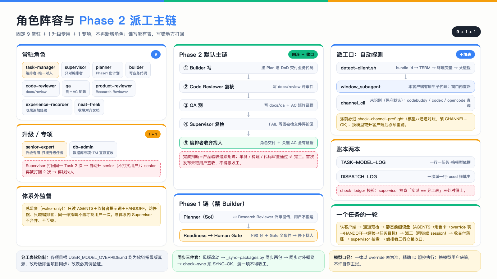

# ORCA Governance Template, Distribution Edition · Navigation (read me first)

[简体中文](./README.md)

> The template name is frozen; the source of truth for versions is this repository's Git history (the version marker file is only a pointer).

Single canonical read order at the start of work: `AGENTS.md` → `docs/roles/` (the role cards for this run) → root `USER_MODEL_OVERRIDE.md` (the model table; use it if present) → `docs/handoff/` (current handover state) → root `经验一句话.md` → and the task goal last.

## The system at a glance

**Two-phase governance flow** (command-driven; the Human Gate cannot be crossed automatically; Change C closes the loop):

**Roles and the Phase 2 dispatch chain** (9 + 1 + 1; auto-detected dispatch port; ledgers and the three-step sync):

## The user only needs three commands

- `第一阶段，计划` (phase 1, plan): enters Phase 1 (PLAN); Planner plus Research Reviewer produce the PRODUCT_PLAN, and only when the score is ≥90 and every template gate condition holds (P0 = 0, blocking P1 = 0, facts and assumptions verified) does it come back to you.
- `第二阶段，开发` (phase 2, develop): after Human Gate approval, enters Phase 2 (DEVELOP) with DEV_BASELINE locked; the default main chain does the work (models per the override table).
- `变更请求：……` (change request): the single entry point for feedback during development; the TM classifies it as A (small change, stays in DEVELOP), B (local functional change, stays in DEVELOP without recalling Sol) or C (product or architecture change, Controlled Reopen).

## Model policy (one line)

Models, channels and invocation methods **always follow the root `USER_MODEL_OVERRIDE.md` table** (the single source; changing the table requires a real call, and exact IDs are copied verbatim). This README deliberately does not restate model IDs, to avoid drifting from the table. To swap a model the user edits the master table directly; the table has no backup column. Assignment tables use symlinks: every project's root table points at the master source, so editing the master propagates to all projects (never copy the file; if the link breaks across machines, copy the real file and record it in HANDOFF).

## Root directory (11 current items)

- `AGENTS.md`: rules for everyone (one page)
- `USER_MODEL_OVERRIDE.md`: the model table (role / model / execution channel / invocation; edit the table and it takes effect, exact IDs copied verbatim)
- `GOVERNANCE_VERSION`: version pointer (its content says: Git history is authoritative)
- `经验一句话.md`: one lesson captured at the end of each session
- `scripts/orchestration/`: L3 watchdog scripts plus deployment notes (anti-stall, paired with the continuous-progress protocol in `docs/prompts/`; deploy only when orchestrating from an Orca terminal or an external channel)
- this `README.md`: navigation; the table in `USER_MODEL_OVERRIDE.md` is itself the model-switching policy (no rules live outside it)

## Map of docs/

- `roles/`: 11 role cards (read only the role you are dispatching)
- `prompts/`: three prompts — orchestrator / external developer / migration-and-tidy (the last doubles as the single entry point for legacy projects, with self-bootstrap: each run pulls the package from the local governance repository itself, so nothing has to be copied by hand and an existing governance layer never causes it to be skipped), plus the *Orca general orchestrator continuous-progress protocol* (three-layer supervision, consolidated edition; its dynamic-role theory conflicts with the ten-card system and is not adopted) and the *Orca governance supervisor prompt* (grand-supervisor, wake-only, normally it only calls the orchestrator)
- `history/`: reshape notes, update notes, the ORCA model and two-phase governance remediation plan (historical — read the root files for what is current)
- `templates/`: the filing-map template
- `pm/` `qa/` `review/`: plans, tests and reviews written to disk (each following its template)
- `handoff/`: handover (template included); `model/`: the model ledger (delete the example row before the first real TASK entry and before the first real DISPATCH) plus the TM qualification test (`TASK-MANAGER-QUALIFICATION.md` spec and report, `TASK-MANAGER-QUALIFICATION-EVENTS.jsonl` events, scored by `scripts/model/tm-qualification.mjs`)
- `sop/`: infrastructure standards (docker.md, supabase.md, sqlite.md, android.md, android-machine-profile.md, webqa.md, decision-router.md, referenced without version numbers); new projects create their own
- `scripts/decision/`: the Decision Sidecar `orca-decide` (usage in its own README and `docs/sop/decision-router.md`)

## Deleted (on the user's instruction; every conclusion was implemented)

- Six historical governance review reports (09-09 → 09-11): all P1/P2 conclusions were fixed and verified; their pre-deletion state is in Git history, and current conclusions live in the files inside the package
- `docs/model/模型分工工作量排名-2026-09-13-参考.md` (removed 2026-09-15; the snapshot had gone stale, see Git history)
- Loose root files were filed: three prompts → `prompts/`, two notes → `history/`, the filing map → `templates/`

## Rename table (one pass that dropped version numbers; use it to find old links)

- `docs/history/2.0-重塑说明.md` → `docs/history/重塑说明.md`
- `docs/history/2.1-更新说明.md` → `docs/history/更新说明.md`
- `docs/history/ORCA-V2.1-治理审查报告-*` → `docs/history/ORCA-治理审查报告-*` (files since deleted, see Git history)
- `docs/history/*ORCA V2.1模型与双阶段治理-整改方案 丨 V1.0.md` → `docs/history/*ORCA模型与双阶段治理-整改方案.md`
- `docs/prompts/*持续推进协议 丨 V1.1.md` → `docs/prompts/Orca 通用编排者持续推进协议.md`
- `docs/sop/*交接上下文 丨 V1.0.md` → trailing ` 丨 V1.0` removed (file since deleted, see Git history)
- Command `【迁移整理｜2.1】` → `【迁移整理】`
- Command `【编排者｜2.1开工】` → `【编排者｜开工】`
- Command `【外部施工｜2.1】` → `【外部施工】`

## Ready-to-use packages

- `新项目模板包/`: the complete file set needed to initialise a new project.
- `老项目迁移模板包/`: the complete file set needed to migrate a legacy project; the entry point is the `【迁移整理】` prompt (self-bootstrapping: it fetches the package from the local governance repository every run, so nothing needs copying by hand, and it will not skip a project that already has governance files).
- `新项目模板包.zip`, `老项目迁移模板包.zip`: the corresponding archives for copying around.
