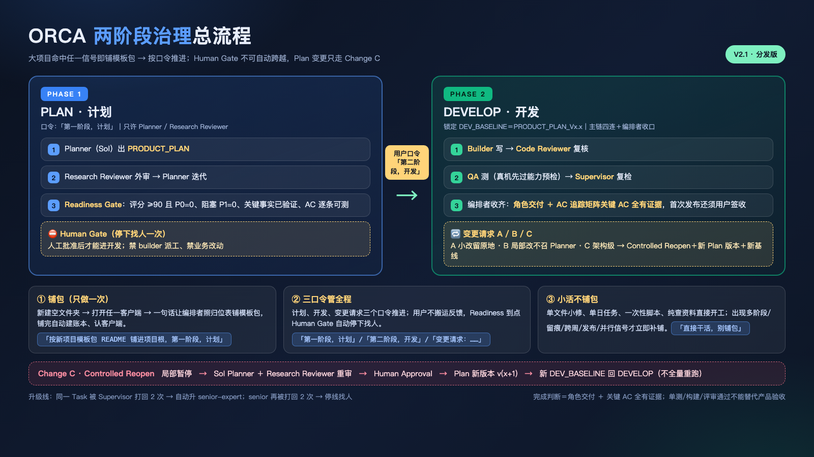

# ORCA 治理模板分发版｜导航（先读我）

[English](./README.en.md)

> 模板名冻结，版本真相以本仓库 Git 提交历史为准（版本标记文件仅为指针）。

开工读盘顺序（全体系唯一）：`AGENTS.md` → `docs/roles/`（本次角色卡）→ 根 `USER_MODEL_OVERRIDE.md`（模型表，有就用它）→ `docs/handoff/`（交接现状）→ 根 `经验一句话.md` → 任务目标放最后。

## 一图看懂（体系全景）

**两阶段治理总流程**（口令推进 · Human Gate 不可自动跨越 · Change C 闭环）：



**角色阵容与 Phase 2 派工主链**（9+1+1 · 自动探测派工口 · 账本与同步三件套）：


## 怎么用：你的操作只有两件事（新建文件夹 ＋ 说一句话）

体系不绑定 Orca，也不绑定任何客户端：**Orca／Trae／Qoder／Codex／CodeArts Agent／opencode／Claude Code** 随便切，编排者每轮开工跑 `scripts/detect-client.sh` 自动认当前客户端并选派工口（有原生子代理就在该客户端窗口内直派；没有就走通道 CLI），**不需要你填任何配置、不需要你指派角色**。

| 场景 | 你要做的 | 说哪一句 |
|---|---|---|
| **新项目·大项目**（多阶段要等你点头／要产品验收留痕／跨周或会交接／要发布上线留回执／多角色并行，命中任一） | ①新建一个空文件夹 ②在里面打开任一客户端 | 见下方【新项目大项目·一句话】（它会自己铺包、建账本、认客户端、派活） |
| **新项目·小项目**（单文件小修／单日单任务／一次性脚本／查资料） | 新建文件夹 ＋ 打开客户端 | `直接干活，别铺包。项目是 XXX，要做 XXX。` |
| **老项目**（本机 `1.Active/` 里已铺好的） | 打开该项目 ＋ 打开客户端 | 直接说事即可：`XXX 项目，第一阶段，计划`（规则、脚本、账本都已就位，**不要重铺包**） |
| **单客户端环境**（只有 shell、没有子代理） | 同上 | 完全一样；探测返回 `channel_cli`，角色走 `opencode run`／`codebuddy -y -p`／`codex exec` 直调，规矩不减，只是少了并行与真 resume |

### 新项目大项目·一句话（复制即可）

```text
按 /Users/zzymima0000/Developer/coding/4.Templates（PC）/2026-09-09 丨 MAC 丨 ORCA V2.1 治理模板 丨 分发版-2026-09-11/新项目模板包/README.md 和它的归位表，把 ORCA 治理模板铺进这个项目根目录（USER_MODEL_OVERRIDE.md 建软链指母版，别拷实文件），铺完你就是本项目编排者。项目是 XXX，第一阶段，计划。
```

之后每一单你只说**业务目标 ＋ 口令**（下面三个口令），铺包/派工/落账/验收全由编排者自己走完。

**别做的事**：不要把 `新项目模板包/` 整个文件夹丢进项目根（会多一层目录、路径全错）；不要拷母版 Git 历史或别的项目的 HANDOFF；老项目不要重铺（规则升级由母版 `scripts/sync-old-projects.sh` 自动铺开）。

### 新项目怎么铺（两种情况，别搞混）

| 项目目录状态 | 怎么做 | 为什么 |
|---|---|---|
| **空目录**（只有 `.git`／`.project.yaml`／`.DS_Store`） | **整包拷** `新项目模板包/` 的**全部内容**到项目根（`cp -R "<母版路径>/新项目模板包/." <项目根>/`，注意末尾 `/.`，不要多套一层目录） | 不会漏文件。人工逐文件铺最容易漏 `docs/model/` 下四本账本空壳、`scripts/model/fixtures/`、后加的模板文件——这些漏了要到后续门禁才爆，且爆的时候查不出来。空目录 `cp -R` 无覆盖风险 |
| **非空目录**（已有文件／已有治理文件／已有业务代码） | **只覆盖规则层＋补新增，实例层一律不碰** | 非空目录整包拷会把实例记录（`docs/pm/` 的计划、`docs/qa/BUGS-*.md`、`docs/handoff/HANDOFF.md`、账本真实行、业务代码）静默顶成空模板，**且不报错** |

**空目录整包拷的正确写法（带回滚保障）**：

```bash
# 1) 目标必须干净
ls -A <项目目录>          # 期望只有 .git / .project.yaml / .DS_Store

# 2) 先原子备份——把「不可逆」变成「可回退」
mv <项目目录> <项目目录>.bak && mkdir <项目目录>

# 3) 整包拷（末尾 /. 关键，漏了会多一层目录）
cp -R "<母版>/新项目模板包/." <项目目录>/

# 4) 校验
ls <项目目录>/docs/qa/产品验收追踪矩阵.template.md                  # 应存在
ls <项目目录>/docs/model/TASK-MANAGER-QUALIFICATION-EVENTS.jsonl    # 应存在（空壳）
# 先删 docs/model/ 下各账本的 `_example` 行（母版/分发包里是模板空壳，新项目直接跑必然报「示例行未删」）
sed -i '' "/\"_example\"/d" <项目目录>/docs/model/*.jsonl
node <项目目录>/scripts/model/check-ledger.mjs                       # 期望 LEDGER-OK
```

**非空目录的「规则层」清单**（只覆盖这几份，其余一律不碰）：
`AGENTS.md`｜`USER_MODEL_OVERRIDE.md`｜`ORCA治理体系说明.md`｜`经验一句话.md`｜`scripts/model/check-ledger.mjs`｜`scripts/detect-client.sh`｜`scripts/check-sync.sh`｜`scripts/check-channel-preflight.sh`
＋ **补新增**（不存在才放，已存在不覆盖）：`docs/qa/产品验收追踪矩阵.template.md`｜`docs/model/TASK-MANAGER-QUALIFICATION-EVENTS.jsonl`｜`docs/model/JEV-DECISION-LOG.jsonl`

**规则文件不要挑行合并**：要么整个文件覆盖，要么按归位表整包处理——手工挑行是这类操作里最容易漏、最容易冲突的做法。

**`USER_MODEL_OVERRIDE.md` 在包里是实文件**（不是软链），落地后按 `AGENTS.md` 的软链制改成软链指母版真源；改之前先备份旧实文件。

## 公开仓怎么不带 ORCA、丢了怎么恢复（可选，仅作品对外公开时用）

**为什么**：默认铺包会把 ORCA 脚手架铺在项目根，推到**公开作品仓**后，克隆的人会看到一堆与产品无关的治理文件。本节给一条**零操作**解法：设一次忽略，此后推送多少次都不会把 ORCA 上传；本地文件一个不少、开发照旧。

**启用（每个要公开的仓跑一次）**：

> 多数情况下**不用你管**：开工跑 `bash "<母版路径>/scripts/orca-public-guard.sh"` 会按可见性自动补齐——公开仓缺忽略块就自动注入并摘除，私有仓跳过（私有仓保留 ORCA 作云备份）。下面两条是手动等价物。

```bash
# 全机自动补齐（推荐）
bash "<母版路径>/scripts/orca-public-guard.sh"

# 或手动：单个要公开的仓
bash "<母版路径>/scripts/orca-gitignore.sh" <项目根> --untrack
```

- 会把一段「ORCA 治理块」（托管、带标记、幂等）写进项目根 `.gitignore`；
- 并把**已经提交过**的 ORCA 脚手架从 git 索引摘除（`--untrack`）——**只影响仓库里要不要收，本地文件不动**；
- 边界＝**只隐藏"每个项目都一样"的通用脚手架**（角色卡／规范／脚本／模板／`AGENTS.md` 等）；**本项目自己的**产品计划、评审、交接、账本、经验**保留在公开仓**作云端备份；应用的 `README.md` 绝不会被藏（那是作品首页）。清单单一真源＝`scripts/orca-public-ignore.txt`。

> 提示：`.gitignore` 只对**未跟踪**的文件生效，所以已经推上去过的 ORCA 文件必须配 `--untrack` 摘一次；摘除后下一次提交公开仓就不再收。本工具**不会自动 commit/push**。

**恢复（万一项目文件夹从云端 clone 回来、发现没有 ORCA）**：

```bash
bash "<母版路径>/scripts/restore-framework.sh" <项目根>
```

- 从本机母版把通用框架补回项目（脚本会自己认母版路径，不用填）；
- **绝不覆盖**你的应用代码、`README.md`、产品计划、评审、交接、账本、经验；
- 补完按提示跑两条自检（`check-channel-preflight.sh` / `check-ledger.mjs`）即可继续开发。

> 本机母版（`4.Templates…/ORCA V2.1 治理模板`）本身就是云端公开仓（`wanghoufan/orca-v2.1-governance`），本机丢了还能拉回来——治理体系本身永远丢不了。

## 用户只需记住三个口令

- `第一阶段，计划`：进 Phase1（PLAN），Planner＋Research Reviewer 出 PRODUCT_PLAN，≥90 且模板 Gate 全条件满足（P0=0＋blocking P1=0＋事实/假设验证）才找你。
- `第二阶段，开发`：Human Gate 批准后进 Phase2（DEVELOP，锁定 DEV_BASELINE），默认主链开发（模型以override表为准）。
- `变更请求：……`：开发中反馈统一入口，TM 按 A（小改留 DEVELOP）/ B（局部功能改留 DEVELOP 不召 Sol）/ C（产品架构变 Controlled Reopen）分类。

## 模型口径（一句话）

模型／通道／调用方式**一律以根 `USER_MODEL_OVERRIDE.md` 表为准**（唯一口径，改表必真调，精确 ID 照抄执行）；本 README 不复述模型 ID，避免与表漂移。换人用户直接改母版真源表；**表内备用两列（备用模型／备用执行通道）以本表为准**，主通道超时/限额时才切备，切备时 DISPATCH `used` 仍填主＋note 记原因。分工表软链制：各项目根表均为软链指母版真源，改母版即全项目同步（禁拷实文件；跨机器断链时拷实文件并记 HANDOFF）。

## 根目录

**入口与规则**
- `AGENTS.md`：全员规则（一页，全体系唯一真源之一）
- `README.md`：本导航（先读我）；`README.en.md`：英文导航
- `ORCA治理体系说明.md`：**对外概览**（体系更新三件套第 2 步必须同步它）
- `USER_MODEL_OVERRIDE.md`：模型表（角色/模型/执行通道/调用方式，**唯一口径**，改表即生效，精确ID照抄执行）
- `GOVERNANCE_VERSION`：版本指针文件（内容：以Git历史为准）
- `CHANGELOG.md`：**变更说明正典**——每次改动并 push 必须在此追加一条（改了什么/为什么/影响谁/怎么验）；只写 commit message 或 HANDOFF 章节不算交差
- `经验一句话.md`：收工一句经验（只追加）
- `agent.md`：**审查交付约定**（审查者须一次性交付完整结论，不分批问；**临时材料，随交接更新，不受 check-sync 门禁**）。接续开工快照在 `temp/agent.md`，两者不是同一份

**脚本（`scripts/`）**
- `detect-client.sh`：自动认当前客户端并选派工口（`window_subagent`／`channel_cli`）；每轮开工先跑它
- `check-channel-preflight.sh`：分工表在用模型 ↔ 通道目录对账，须 `CHANNEL-OK` 才可派工
- `weekly-channel-check.sh` ＋ `_inject-agents-block.py`、`sync-old-projects.sh`、`migration-status.sh`、`_sync-packages.py`（母版→两包同步唯一入口，**禁手写 sed 复制**）
- `model/check-ledger.mjs`：**两本**账校验（`TASK-MODEL-LOG`／`DISPATCH-LOG`；`TASK-MANAGER-QUALIFICATION-EVENTS` 由 `tm-qualification.mjs` 校验）；另含 **APP 基线硬门**（`APP-BASELINE-MISSING`／`APP-CRITICAL-AC-EMPTY`／`APP-CRITICAL-AC-INCOMPLETE`，2026-10-08 起为 FAIL 不再是 WARN）。母版/分发包自检用 `--allow-example`（**真实项目禁用**，否则等于放过「示例行未删」）
- `decision/orca-decide.mjs`：决策侧车；`orchestration/`：L3 watchdog（仅外部/终端编排时部署）
- `check-sync.sh`：母版↔两包一致性门禁（归一化裸名后逐字节比对），须 `SYNC-OK`
- `orca-gitignore.sh` ＋ `orca-public-ignore.txt` ＋ `restore-framework.sh`：**公开仓不带 ORCA** 三件套（注入忽略块＋摘除已跟踪 ORCA / 忽略清单单一真源 / clone 回来补回框架）。仅作品对外公开时用，详见上方「公开仓怎么不带 ORCA」
- `orca-public-guard.sh`：**自动**按可见性补齐——扫全部项目，公开仓缺忽略块就自动注入并摘除，私有仓跳过；开工跑一次即可，无需逐仓交代

**包**
- `新项目模板包/`（新项目初始化）、`老项目迁移模板包/`（老项目迁移，入口【迁移整理】提示词）。两包内容由 `scripts/_sync-packages.py` 从母版生成，**不要手改包内文件**。

## docs/ 地图

- `roles/`：11张角色卡（只看本次派的角色）
- `prompts/`：编排者/外部开发者/迁移整理三份提示词（迁移整理含自举取包＋冲突处理，可当老项目唯一入口）＋《Orca 通用编排者持续推进协议》（防停摆三层监督收编版；其动态角色论与十卡制冲突，不采用）＋《Orca 编排治理监督者提示词》（总监督wake-only收编版，平时只喊编排者）
- `history/`：重塑说明、更新说明、ORCA 模型与双阶段治理整改方案（历史，看现行先看根）
- `templates/`：归位表模板
- `pm/` `plan/` `qa/` `review/`：计划/测试/评审落盘（各照 template）。`pm/` 是**本轮**计划（Phase1 产品计划、Phase2 Stage/Task），`plan/` 是**后续开发计划**（V2/V3 路线图，版本序列/排序/取舍/暂不排期候选），两者分开不混
- `handoff/`：交接（含模板）；`model/`：模型账本（TASK 首个真实任务前、DISPATCH 首个真实派工前删示例行）＋ TM 资格测试（`TASK-MANAGER-QUALIFICATION.md` 规范/报告、`TASK-MANAGER-QUALIFICATION-EVENTS.jsonl` 事件，评分 `scripts/model/tm-qualification.mjs`）
- `sop/`：基础设施规范（docker.md、supabase.md、sqlite.md、android.md、android-machine-profile.md、webqa.md、decision-router.md、**app-theme-i18n.md**（APP 基础能力：主题三态＋中英双语）、**app-brand-assets.md**（APP 品牌资产：中文名／英文名／安卓图标／启动画面，面向用户 APP 默认继承）、**background-services.md**，去版本号引用），新项目自建
- `scripts/decision/`：Decision Sidecar orca-decide（用法见其 README 与 docs/sop/decision-router.md）

## 已删除（用户令，结论均已落实）

- 历史治理审查报告6份（09-09→09-11）：P1/P2结论已全部修完验过，删前状态见 git 历史；现行结论以包内文件为准
- `docs/model/模型分工工作量排名-2026-09-13-参考.md`（2026-09-15 删，快照过期，见 git 历史）
- 根散文件已归位：三提示词→`prompts/`、两说明→`history/`、归位表→`templates/`

## 改名对照（去版本号一次改名，老链接按此找新位置）

- `docs/history/2.0-重塑说明.md` → `docs/history/重塑说明.md`
- `docs/history/2.1-更新说明.md` → `docs/history/更新说明.md`
- `docs/history/ORCA-V2.1-治理审查报告-*` → `docs/history/ORCA-治理审查报告-*`（实物已删，见 git 历史）
- `docs/history/*ORCA V2.1模型与双阶段治理-整改方案 丨 V1.0.md` → `docs/history/*ORCA模型与双阶段治理-整改方案.md`
- `docs/prompts/*持续推进协议 丨 V1.1.md` → `Orca 通用编排者持续推进协议.md`
- `docs/sop/*交接上下文 丨 V1.0.md` → 去掉末尾 ` 丨 V1.0`（该文件已删，见 git 历史）
- 口令 `【迁移整理｜2.1】` → `【迁移整理】`
- 口令 `【编排者｜2.1开工】` → `【编排者｜开工】`
- 口令 `【外部施工｜2.1】` → `【外部施工】`

## 可直接使用的模板包

- `新项目模板包/`：新项目初始化所需的完整文件包。
- `老项目迁移模板包/`：老项目迁移所需的完整文件包；入口是 `【迁移整理】` 提示词（含自举取包：它每次都自己去本机治理仓库取包，无需你手动拷贝，也不会因项目已有治理文件而跳过）。
